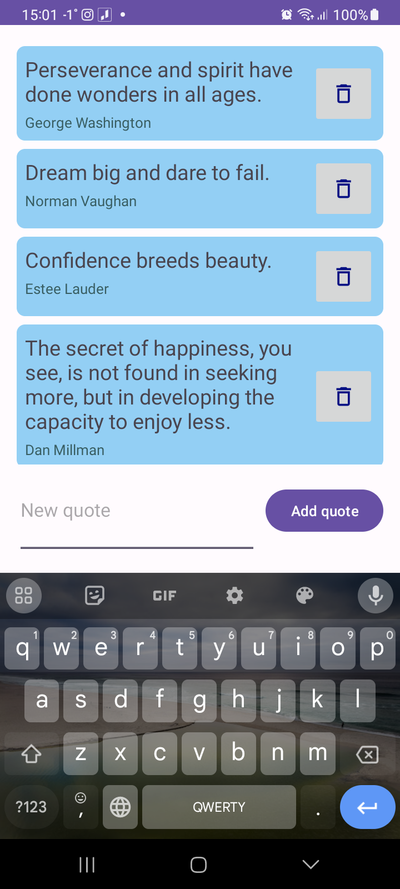
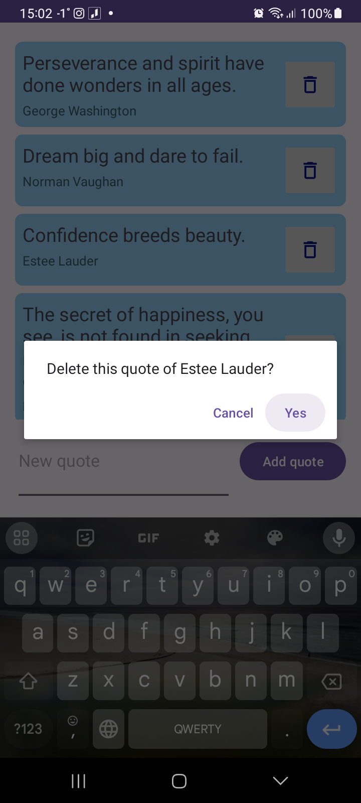

# Great Quotes 

Simple list of inspiring quotes downloaded via **Retrofit** from free [Zenquotes API](https://zenquotes.io/) 
The list is displayed in a **RecyclerView**  
**AsyncListDiffer** with **DiffUtil** are used to calculate list changes in a more efficient way.  
Items on the list are decorated with rounded corner background drawable.  
Each quote can be deleted after confirmation in **AlertDialog**. Also new quotes can be added to the list.
 
 

